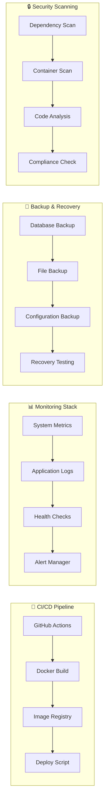

# 🏗️ Infrastructure Overview

ภาพรวมของโครงสร้างระบบและการจัดการ Infrastructure

## 🌐 High-Level Architecture

```
                    🌍 Internet
                         │
                    ┌────▼────┐
                    │ DNS/CDN │ yourdomain.com
                    └────┬────┘
                         │
                ┌────────▼────────┐
                │  Load Balancer  │ (Optional)
                └────────┬────────┘
                         │
           ┌─────────────▼─────────────┐
           │    Ubuntu Server         │
           │  ┌─────────────────────┐ │
           │  │     Nginx Proxy     │ │ :80/:443
           │  │   SSL Termination   │ │
           │  └─────────┬───────────┘ │
           │            │             │
           │  ┌─────────▼───────────┐ │
           │  │   Docker Network    │ │
           │  │ ┌─────┬─────┬─────┐ │ │
           │  │ │ F-E │ B-E │ DB  │ │ │
           │  │ │:3000│:1337│:5432│ │ │
           │  │ └─────┴─────┴─────┘ │ │
           │  └─────────────────────┘ │
           │                         │
           │  ┌─────────────────────┐ │
           │  │   System Services   │ │
           │  │ • Webhook Server    │ │
           │  │ • Health Monitor    │ │
           │  │ • Log Manager       │ │
           │  │ • Backup Service    │ │
           │  └─────────────────────┘ │
           └─────────────────────────┘
```

## 🐳 Docker Container Architecture

```
┌─────────────────────────────────────────────────────────────┐
│                    Docker Compose Network                   │
│                          (Bridge)                          │
│                                                             │
│  ┌──────────────┐  ┌──────────────┐  ┌──────────────┐     │
│  │  Frontend    │  │   Backend    │  │   Database   │     │
│  │              │  │              │  │              │     │
│  │ ┌──────────┐ │  │ ┌──────────┐ │  │ ┌──────────┐ │     │
│  │ │Next.js   │ │  │ │ Strapi   │ │  │ │PostgreSQL│ │     │
│  │ │Node.js 20│ │  │ │Node.js   │ │  │ │15-alpine │ │     │
│  │ │Port: 3000│ │  │ │Port: 1337│ │  │ │Port: 5432│ │     │
│  │ └──────────┘ │  │ └──────────┘ │  │ └──────────┘ │     │
│  │              │  │              │  │              │     │
│  │ Volumes:     │  │ Volumes:     │  │ Volumes:     │     │
│  │ • .next/     │  │ • uploads/   │  │ • data/      │     │
│  │ • public/    │  │ • config/    │  │ • backups/   │     │
│  │ • logs/      │  │ • logs/      │  │ • init.sql   │     │
│  └──────────────┘  └──────────────┘  └──────────────┘     │
│                                                             │
│  ┌─────────────────────────────────────────────────────┐   │
│  │                 Nginx Container                     │   │
│  │                                                     │   │
│  │ ┌─────────────────────────────────────────────────┐ │   │
│  │ │         Nginx (Alpine)                          │ │   │
│  │ │         Ports: 80, 443                          │ │   │
│  │ │                                                 │ │   │
│  │ │ Config Mounts:                                  │ │   │
│  │ │ • /etc/nginx/conf.d/default.conf               │ │   │
│  │ │ • /etc/ssl/certs/ (SSL certificates)           │ │   │
│  │ │ • /var/log/nginx/ (Access/Error logs)          │ │   │
│  │ └─────────────────────────────────────────────────┘ │   │
│  └─────────────────────────────────────────────────────┘   │
└─────────────────────────────────────────────────────────────┘
```

## 🔧 Service Dependencies

```mermaid
graph TD
    subgraph "🖥️ Host System"
        H1[Ubuntu Server 20.04+]
        H2[Docker Engine]
        H3[Docker Compose]
        H4[Nginx (Host)]
        H5[UFW Firewall]
        H6[Systemd Services]
    end
    
    subgraph "🐳 Container Layer"
        C1[jeval-frontend]
        C2[jeval-backend]
        C3[jeval-db]
        C4[nginx-proxy]
    end
    
    subgraph "🔧 Application Services"
        A1[Webhook Server]
        A2[Health Monitor]
        A3[Log Rotation]
        A4[Backup Service]
    end
    
    subgraph "🌐 External Services"
        E1[GitHub Repository]
        E2[Docker Registry]
        E3[Let's Encrypt]
        E4[DNS Provider]
    end
    
    H1 --> H2
    H2 --> H3
    H3 --> C1
    H3 --> C2
    H3 --> C3
    H4 --> C4
    H6 --> A1
    H6 --> A2
    H6 --> A3
    H6 --> A4
    
    C1 --> C2
    C2 --> C3
    
    A1 --> E1
    C1 --> E2
    H4 --> E3
    H4 --> E4
```

## 📁 File System Structure

```
🖥️ Production Server File System
│
├── 📂 /opt/jeval-frontend/              # Application Root
│   ├── 📂 app/                          # Next.js Application
│   │   ├── 📂 components/
│   │   ├── 📂 pages/
│   │   ├── 📂 public/
│   │   └── 📂 .next/                    # Build Output
│   │
│   ├── 📂 scripts/                      # Deployment Scripts
│   │   ├── 🔧 setup-ubuntu.sh
│   │   ├── 🚀 deploy.sh
│   │   ├── 🔄 git-deploy.sh
│   │   ├── 📊 health-check.sh
│   │   └── 🌐 webhook-server.js
│   │
│   ├── 📂 nginx/                        # Nginx Configuration
│   │   └── 📄 nginx.conf
│   │
│   ├── 📂 .github/workflows/           # CI/CD Pipelines
│   │   └── 📄 deploy.yml
│   │
│   ├── 🐳 docker-compose.yml           # Container Orchestration
│   ├── 🐳 Dockerfile                   # Container Build
│   ├── ⚙️ .env.production              # Environment Config
│   └── 📋 package.json                 # Dependencies
│
├── 📂 /var/log/jeval-frontend/         # Log Files
│   ├── 📄 deploy.log                   # Deployment Logs
│   ├── 📄 webhook.log                  # Webhook Logs
│   ├── 📄 health-check.log             # Health Check Logs
│   └── 📄 error.log                    # Application Errors
│
├── 📂 /var/backups/jeval-frontend/     # Backup Storage
│   ├── 📂 backup-20240301-120000/      # Timestamped Backups
│   ├── 📂 backup-20240302-120000/
│   └── 📂 pre_deploy_main_*/           # Pre-deployment Backups
│
├── 📂 /etc/nginx/                      # Nginx System Config
│   ├── 📂 sites-available/
│   ├── 📂 sites-enabled/
│   ├── 📂 ssl/                         # SSL Certificates
│   └── 📄 nginx.conf
│
├── 📂 /etc/systemd/system/             # System Services
│   ├── 📄 jeval-webhook.service        # Webhook Service
│   ├── 📄 jeval-frontend.service       # Application Service
│   └── 📄 jeval-deploy.service         # Deployment Service
│
└── 📂 /usr/local/bin/                  # Helper Commands
    ├── 🔧 jeval-start
    ├── 🔧 jeval-stop
    ├── 🔧 jeval-status
    └── 🔧 jeval-deploy
```

## 🔌 Network Configuration

```
┌─────────────────────────────────────────────────────────────┐
│                      Network Layout                         │
│                                                             │
│  Internet (Port 80/443)                                    │
│              │                                              │
│              ▼                                              │
│  ┌─────────────────┐                                       │
│  │  UFW Firewall   │ Allow: 22,80,443,9000                │
│  └─────────┬───────┘                                       │
│            │                                               │
│            ▼                                               │
│  ┌─────────────────┐                                       │
│  │  Nginx Proxy    │ :80 → :443 (SSL Redirect)            │
│  │                 │ :443 → :3000 (Frontend)              │
│  └─────────┬───────┘ API routes → :1337 (Backend)         │
│            │                                               │
│            ▼                                               │
│  ┌─────────────────────────────────────┐                  │
│  │        Docker Network               │                  │
│  │  ┌─────────┐ ┌─────────┐ ┌───────┐ │                  │
│  │  │Frontend │ │Backend  │ │  DB   │ │                  │
│  │  │  :3000  │ │ :1337   │ │ :5432 │ │                  │
│  │  └─────────┘ └─────────┘ └───────┘ │                  │
│  └─────────────────────────────────────┘                  │
│                                                             │
│  External Access:                                          │
│  • GitHub Webhook → :9000                                 │
│  • SSH Access → :22                                       │
│  • Health Checks → :3000/api/health                       │
└─────────────────────────────────────────────────────────────┘
```

## 🔒 Security Layers

```mermaid
graph TD
    subgraph "🛡️ Security Stack"
        S1[Internet Edge] --> S2[DNS/CDN Security]
        S2 --> S3[Firewall (UFW)]
        S3 --> S4[SSL/TLS Termination]
        S4 --> S5[Nginx Security Headers]
        S5 --> S6[Rate Limiting]
        S6 --> S7[Application Security]
        S7 --> S8[Container Isolation]
        S8 --> S9[Database Security]
    end
    
    subgraph "🔐 Authentication"
        A1[JWT Tokens] --> A2[Session Management]
        A2 --> A3[User Permissions]
        A3 --> A4[API Authentication]
    end
    
    subgraph "📊 Monitoring"
        M1[Fail2ban] --> M2[Log Analysis]
        M2 --> M3[Intrusion Detection]
        M3 --> M4[Alert System]
    end
```

## 📈 Scaling Strategy

### 🔄 Horizontal Scaling

```
Single Server → Load Balanced → Microservices
     │                 │              │
     ▼                 ▼              ▼
┌─────────┐    ┌──────────────┐   ┌─────────────┐
│ Server  │    │ Load         │   │ Service     │
│ All-in  │    │ Balancer     │   │ Mesh        │
│ One     │    │      │       │   │ (K8s)       │
└─────────┘    │  ┌───▼───┐   │   │ ┌─────────┐ │
               │  │Server1│   │   │ │Frontend │ │
               │  └───────┘   │   │ │Services │ │
               │  ┌───────┐   │   │ └─────────┘ │
               │  │Server2│   │   │ ┌─────────┐ │
               │  └───────┘   │   │ │Backend  │ │
               └──────────────┘   │ │Services │ │
                                  │ └─────────┘ │
                                  │ ┌─────────┐ │
                                  │ │Database │ │
                                  │ │Cluster  │ │
                                  │ └─────────┘ │
                                  └─────────────┘
```

### ⚡ Performance Optimization

```mermaid
graph TB
    subgraph "🚀 Performance Layers"
        P1[CDN Caching] --> P2[Nginx Caching]
        P2 --> P3[Application Caching]
        P3 --> P4[Database Caching]
        P4 --> P5[Connection Pooling]
    end
    
    subgraph "📊 Monitoring Points"
        M1[Response Time] --> M2[Throughput]
        M2 --> M3[Resource Usage]
        M3 --> M4[Error Rates]
    end
    
    subgraph "⚖️ Auto Scaling Triggers"
        T1[CPU > 80%] --> T2[Memory > 85%]
        T2 --> T3[Request Queue > 100]
        T3 --> T4[Response Time > 2s]
    end
```



## 🔧 Deployment Environments

```
Development → Staging → Production
     │           │          │
     ▼           ▼          ▼
┌─────────┐ ┌─────────┐ ┌─────────┐
│Local    │ │Testing  │ │Live     │
│Machine  │ │Server   │ │Server   │
│         │ │         │ │         │
│• npm    │ │• Docker │ │• Docker │
│  run dev│ │  Compose│ │  Compose│
│• Hot    │ │• CI/CD  │ │• Load   │
│  Reload │ │  Tests  │ │  Balancer│
│• Debug  │ │• Preview│ │• CDN    │
│  Mode   │ │  URLs   │ │• SSL    │
└─────────┘ └─────────┘ └─────────┘
```

## 🛠️ DevOps Tools Integration



## 🎯 Key Infrastructure Metrics

### 📊 **Performance Targets:**
- **Response Time:** < 2 seconds average
- **Uptime:** > 99.5%
- **Deployment Time:** < 5 minutes
- **Recovery Time:** < 2 minutes

### 💾 **Resource Allocation:**
- **CPU:** 2-4 cores per service
- **Memory:** 4-8 GB total
- **Storage:** 20-50 GB (auto-expand)
- **Network:** 100 Mbps minimum

### 🔄 **Backup Strategy:**
- **Database:** Daily automated backups
- **Files:** Weekly full backups
- **Configuration:** Git-based versioning
- **Recovery:** < 30 minutes RTO

---

**หมายเหตุ:** Infrastructure นี้ออกแบบให้รองรับการขยายตัวในอนาคต และสามารถปรับแต่งตาม traffic และความต้องการของระบบ