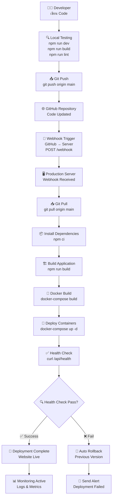
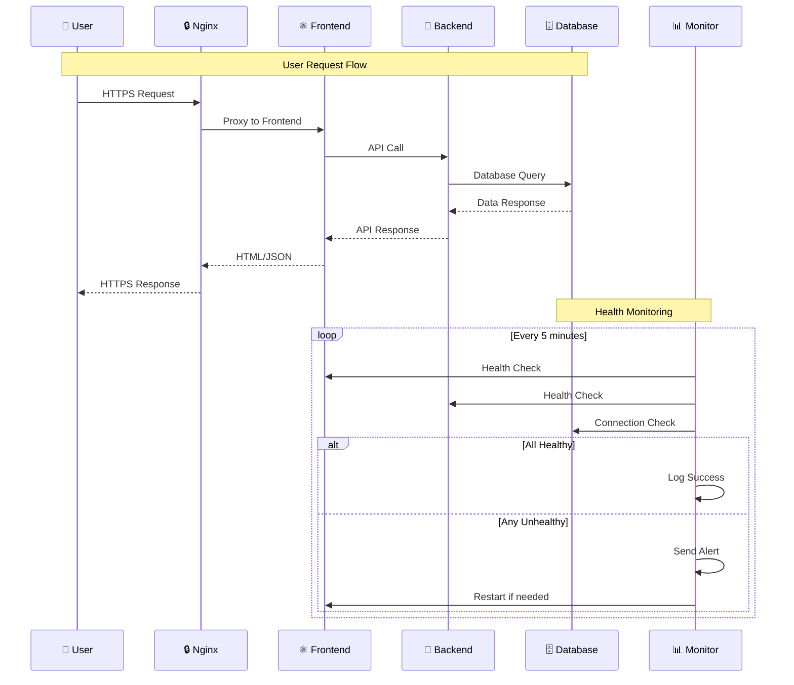
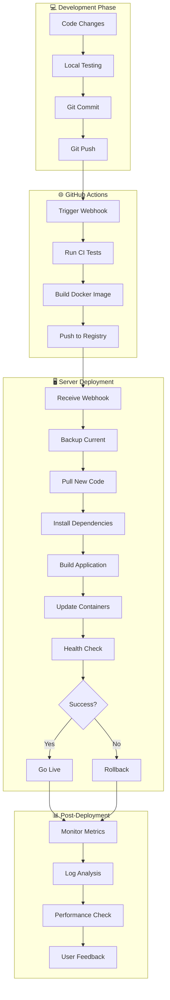
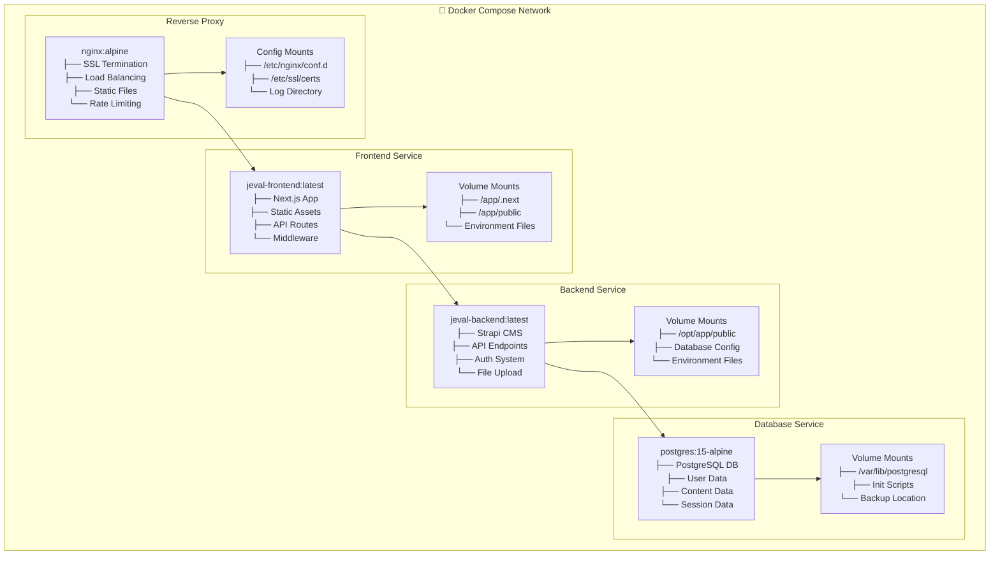
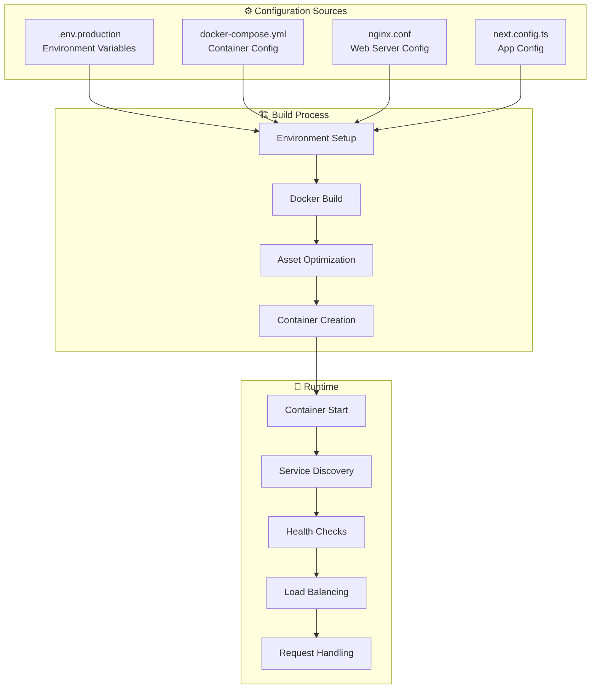
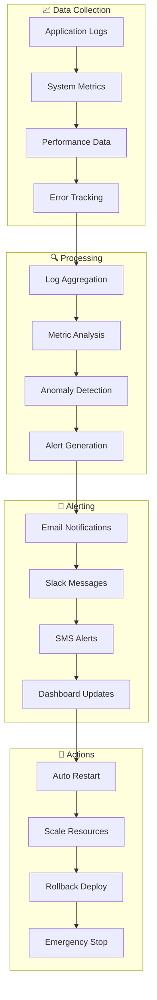
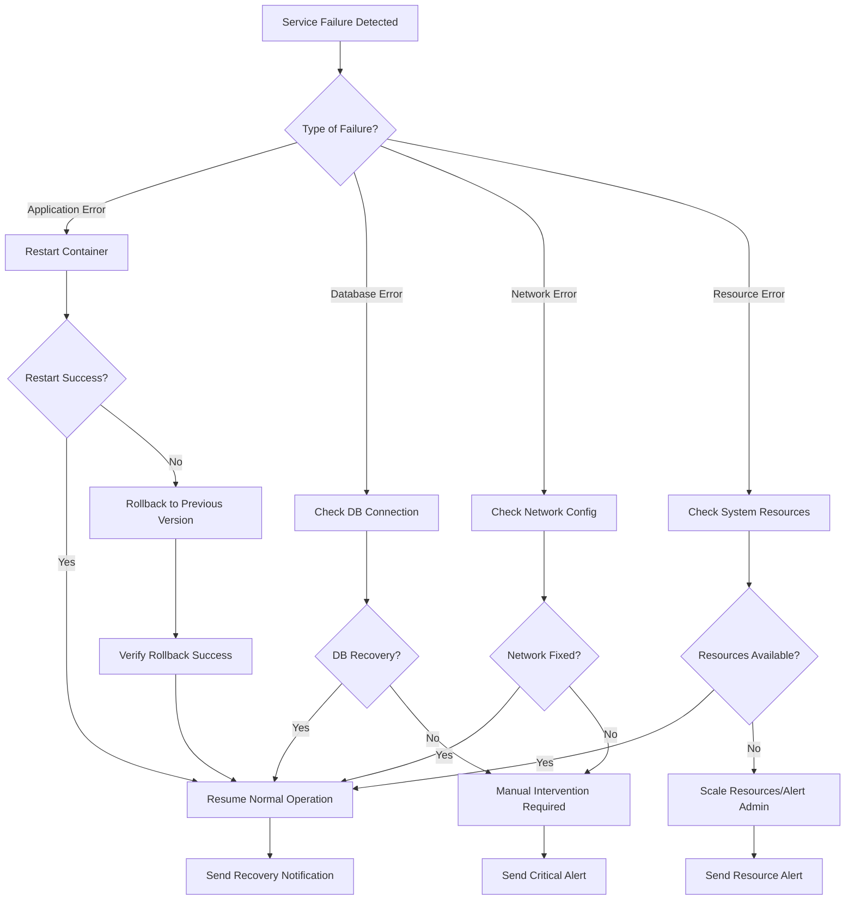

# 🏗️ System Flow Process Diagram

แสดงการทำงานของระบบตั้งแต่การ deploy code จนถึงการทำงานของ services ทั้งหมด

## 🚀 Deployment Flow Process



## 🏛️ System Architecture Flow

```mermaid
graph TB
    subgraph "🌐 Internet"
        U[👥 Users]
        D[🌍 Domain<br/>yourdomain.com]
    end
    
    subgraph "🖥️ Production Server"
        subgraph "🔒 Nginx (Port 80/443)"
            N[Nginx<br/>Reverse Proxy<br/>SSL Termination]
        end
        
        subgraph "🐳 Docker Network"
            subgraph "Frontend Container"
                F[Next.js Frontend<br/>Port: 3000<br/>Node.js 20]
            end
            
            subgraph "Backend Container"
                B[Strapi Backend<br/>Port: 1337<br/>API Services]
            end
            
            subgraph "Database Container"
                DB[(PostgreSQL<br/>Port: 5432<br/>Data Storage)]
            end
        end
        
        subgraph "🛠️ System Services"
            W[Webhook Server<br/>Port: 9000<br/>Auto Deploy]
            M[Health Monitor<br/>System Check]
            L[Log Manager<br/>Rotate & Archive]
        end
        
        subgraph "💾 File System"
            APP[/opt/jeval-frontend<br/>Application Files]
            LOG[/var/log/jeval-frontend<br/>Log Files]
            BAK[/var/backups<br/>Backup Files]
        end
    end
    
    U --> D
    D --> N
    N --> F
    F --> B
    B --> DB
    
    W --> APP
    M --> F
    M --> B
    L --> LOG
```

## 🔄 Service Interaction Flow



## 🚀 Deployment Process Detail



## 🏗️ Container Architecture



## 📡 Data Flow Process

```mermaid
graph LR
    subgraph "📱 Client Side"
        C1[Browser] --> C2[React Components]
        C2 --> C3[API Calls]
        C3 --> C4[State Management]
    end
    
    subgraph "🔗 Network Layer"
        N1[HTTPS Request] --> N2[Nginx Proxy]
        N2 --> N3[Load Balancing]
        N3 --> N4[Rate Limiting]
    end
    
    subgraph "⚛️ Frontend Server"
        F1[Next.js Router] --> F2[Page Components]
        F2 --> F3[API Routes]
        F3 --> F4[Middleware]
        F4 --> F5[Authentication]
    end
    
    subgraph "🚀 Backend Server"
        B1[Strapi Router] --> B2[Controllers]
        B2 --> B3[Services]
        B3 --> B4[Models]
        B4 --> B5[Database Layer]
    end
    
    subgraph "🗄️ Database"
        D1[PostgreSQL] --> D2[Tables]
        D2 --> D3[Indexes]
        D3 --> D4[Relations]
    end
    
    C4 --> N1
    N4 --> F1
    F5 --> B1
    B5 --> D1
    
    D4 --> B5
    B5 --> F5
    F5 --> N4
    N4 --> C4
```



## 🔧 Configuration Flow



## 📊 Monitoring & Logging Flow



## 🚨 Failure & Recovery Flow



## 📋 Summary

### 🎯 **Key Components:**
- **Frontend:** Next.js application (Port 3000)
- **Backend:** Strapi API services (Port 1337)  
- **Database:** PostgreSQL (Port 5432)
- **Proxy:** Nginx (Port 80/443)
- **Automation:** Webhook server (Port 9000)

### 🔄 **Process Flow:**
1. **Development:** Code → Test → Push
2. **Deployment:** Webhook → Pull → Build → Deploy
3. **Runtime:** User Request → Frontend → Backend → Database
4. **Monitoring:** Health Check → Metrics → Alerts → Actions

### ⚡ **Performance Characteristics:**
- **Deployment Time:** 2-5 minutes
- **Recovery Time:** < 2 minutes (auto rollback)
- **Health Check:** Every 5 minutes
- **Zero Downtime:** Blue-green deployment support

---

**หมายเหตุ:** Diagrams เหล่านี้แสดงการทำงานของระบบทั้งหมด ตั้งแต่การ deploy จนถึงการให้บริการผู้ใช้